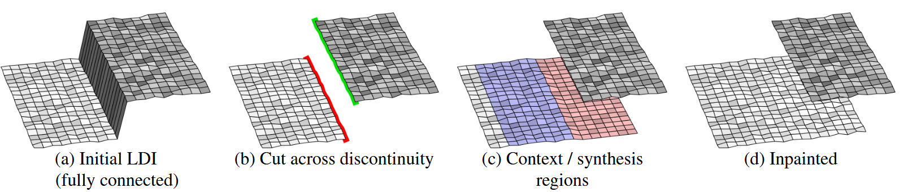
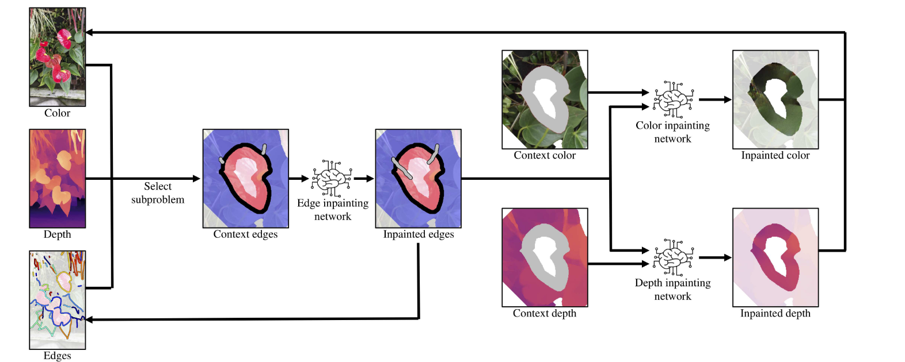

##### 手工视差动画原理

传统方法将人物和背景扣出来，然后移动相机位置。

- 问题：

- 方法：

- 结果：

- 局限：

##### CVPR 2020 | 3D Photography using Context-aware Layered Depth Inpainting

https://shihmengli.github.io/3D-Photo-Inpainting/

- 问题：generates a Layered Depth Image (LDI) with **inpainted color and depth** in parts that were occluded in the input.将3d图片生成问题视为带有深度的inpaint任务

- 表示方法：**带有连接信息**的LDI，相邻像素位置的像素且深度没有突变则相连。**LDI转成mesh，然后渲染。**

  - MDI:所有图片都用固定数量的层数表示，每一层是RGB-α，α是透明度，例如第一层的效果是玻璃上有个前景物体
  - LDI:每一个像素位置有一个深度栈，里面有多个像素深度对（像素），比如某个位置第一层是人脸深度2m，第二层是街道深度10m

- 方法：1.找出depth edges 2.对于每一个depth edges得到对应Context / synthesis regions 3.用神经网络生成color+depth 

  

  - 网络：用的现成的U-Net，生成的时候只能看到context regions，创新是先（根据context regions的edge等信息）预测synthesis regions 的 edge，然后用edge分别预测color+depth，帮助color&depth对齐。训练时采用任意数据集，coco。故意遮挡然后看补全和原图是否一致。

    

- 结果：和MPI的方法比较，在视频数据集上，从源帧（t = 0）和参考帧（t = 4）向前外推到 t = 10。比较SSIM  PSNR LPIPS

  | 指标                                                 | 核心衡量                   | 主要用来评估        |
  | ---------------------------------------------------- | -------------------------- | ------------------- |
  | **SSIM**(Structural Similarity)                      | 亮度 L + 对比度 C + 结构 S | 图像**结构保真度**  |
  | **PSNR**(Peak Signal-to-Noise Ratio)                 | 均方误差 MSE 的 log 比     | 像素级 **误差能量** |
  | **LPIPS**(Learned Perceptual Image Patch Similarity) | 深度特征距离               | **人眼主观相似度**  |

- 局限：现在的扩散模型的inpaint方法效果肯定好于这个。但是流程设计可以借鉴。

##### CVPR 2021 NeX: Real-time View Synthesis with Neural Basis Expansion

https://nex-mpi.github.io/

- 问题：通过**多张图片**进行新视角合成

- 方法：新视角合成。MPI,每一个像素位置x,y,d,不存放rgb+α，而存放一个α+基础函数（可以将这个基础函数视为球谐函数变体）。

  但是能够实现cd上随视角变幻的彩虹效果，以及一些玻璃效果，反观上面文章的方法只能将解决漫反射的情况。

  

  将每一个x,y,d输入网络，得到球谐函数的参数k1-kN，然后H就是球谐函数，视角是自变量，得到渲染图片。

  

  训练过程就是用渲染图片和gt图片做损失，加个正则项。

  

- 结果：和nerf等方法比较SSIM  PSNR LPIPS

- 局限
  - 继承了MDI方法的问题：在视角太歪的时候会出现“卡片堆叠”（stack of cards）伪影
  
  - 仍然无法完全重现 Shiny 数据集中最难的场景，比如光点、高亮反射或试管中的折射等复杂光学现象。
  
  - 如果训练图像的亮度、曝光时间不统一，生成的 MPI 层可能在连续帧中亮度跳变
  
  - 尽管比 NeRF 等方法快，但训练 NeX 仍需要大量时间和多视角数据，这在实际采集和部署中是一种负担
  
##### MultiDiff: Consistent Novel View Synthesis from a Single Image

  https://sirwyver.github.io/MultiDiff/

  单张图像+深度先验+视频先验=大量新视角，甚至是在原来参考图片中根本没有的内容

  3D-Unet 不是能研究的

##### SIGGRAPH2022:  Single-View View Synthesis in the Wild with Learned Adaptive Multiplane Images

https://yxuhan.github.io/AdaMPI/index.html

- 改进MPI，MPI是固定深度，这个工作调整每一层的深度，并计算调整后的颜色和透明度

- 效果超越 3D-photo

TOG 2019 Adobe **3D Ken Burns Effect from a Single Image**

[Turning Photos into 2.5 Parallax Animations with Machine Learning - Waxy.org](https://waxy.org/2019/11/turning-photos-into-2-5d-parallax-animations-with-machine-learning/)

这个可以试试效果，博客里面提供了colab

[Simon Niklaus - 3D Ken Burns Effect from a Single Image](https://sniklaus.com/kenburns)

- 首先提出了semantic-aware neural network for depth estimation

  - 一个object的深度不应该突变，边界应该清晰，深度估计应该用到语义特征（告诉网络这是一个地面，则其深度不容易扭曲，减轻几何扭曲问题）

    

  - 对于一个对象，取其最小深度作为整个对象的深度，虽然不准确，但是手工都是这么做的，效果好。

  - inpaint用的自己设计的网络 “GridNet [Fourure et al. 2017] architecture”

- 结果：inpaint效果是用用户问卷方法比较的。和youtube上面手工制作的视频比效果。深度估计和sota比效果

- 局限：分割有问题则有问题，反射处理不了，伪影。

IJCV 2023 Single-View View Synthesis with Self-rectified Pseudo-Stereo

 

不权威文章

2024 *Applied Sciences*  A Virtual View Acquisition Technique for Complex Scenes of Monocular Images Based on Layered Depth Images

2022 没发出去 Stereo Unstructured Magnification: Multiple Homography Image for View Synthesis

关键词

motion parallax 视差动画 

3D Ken Burns effect
